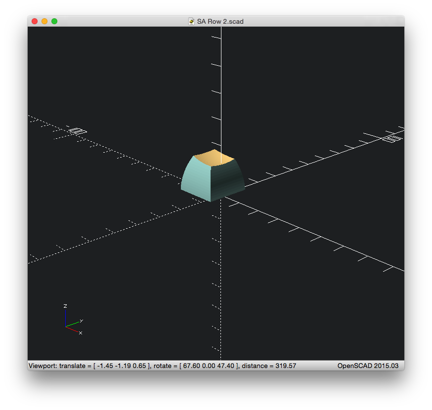
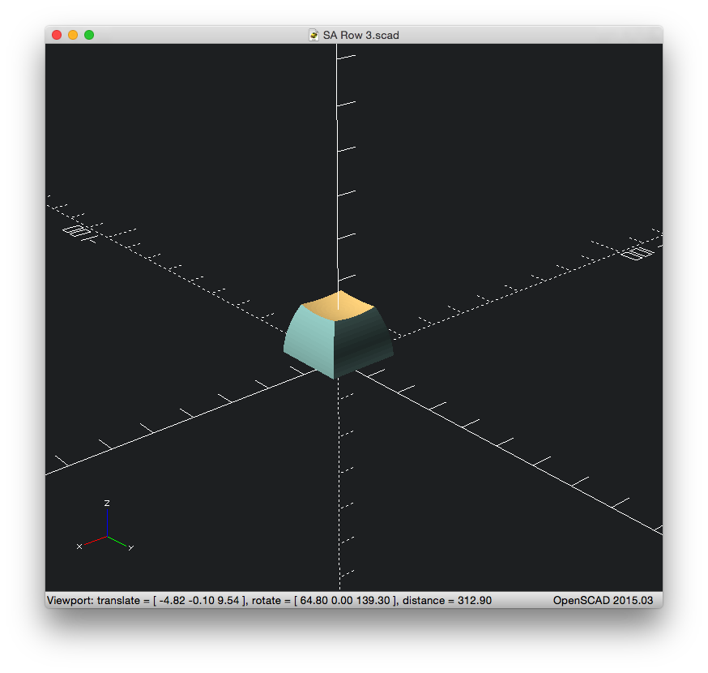

# SA Profile Keys 3D models

Work in progress

Initial work SA Row 3 1u (in error. The sides are not spherical chords, they are cylindrical chords.)

Test render all SA R3 1u: (Blender Cycles renderer is pretty nice)

Rows 1,2,3 as SCAD

Row 4 is R2 flipped

Now working on the 1.25, 1.5, 1.75, 2, 2.25 etc. keys (plus a 6.25 spacebar)
